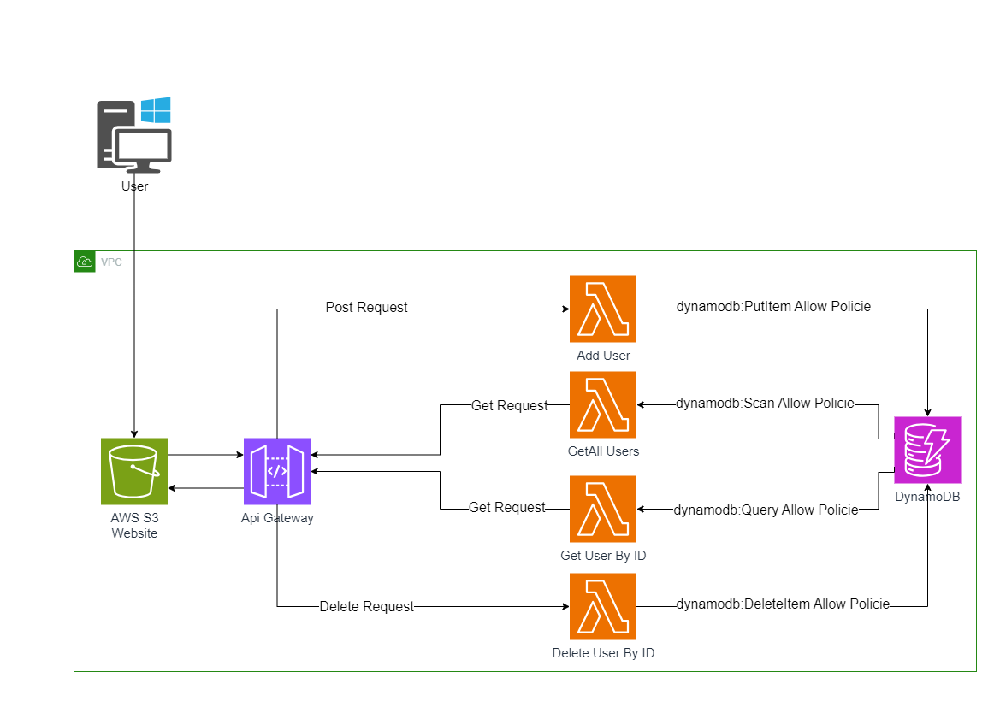

# AWS Lambda - API Gateway - S3 - DynamoDB

---

# Ziel

Unser Ziel ist es, Serverless-Lambda-Funktionen als Backend zu verwenden, DynamoDB als Datenbank zu nutzen, S3 für unsere Website zu hosten und das API-Gateway als Middleware zwischen unserer Website und dem Backend einzusetzen.

- ***Die Website kann derzeit [hier](http://client-management-v1.s3-website.eu-central-1.amazonaws.com) besucht werden***

---
## Steps:

- terraform init
- ändern in  main.tf dein AWS ACCOUNT NUMBER
- ändern in usermanader > src > app > Services > user.service.ts : url = DEINE API_Gateway_Endpoint
- cd usermanager
- ng build
- upload die daten unter dist/usermanager in deine S3 Bucket

# Ende

***Happy Hacking***